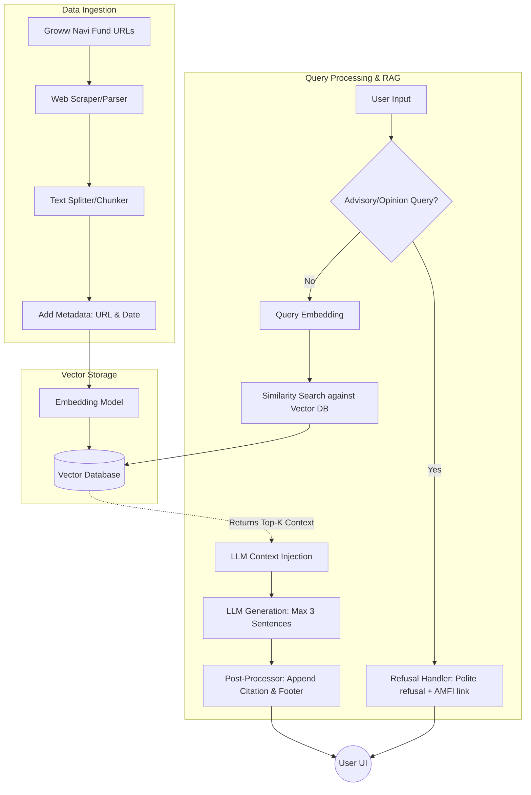

# Architecture Document: Mutual Fund FAQ Assistant (RAG-based)

This document outlines the detailed system architecture for the Mutual Fund FAQ Assistant, designed based on the specifications in `docs/context.md`. The assistant leverages a Retrieval-Augmented Generation (RAG) approach to ensure that responses are strictly factual, verifiable, and constrained to the provided official public sources.

---

## 1. High-Level Architecture Overview

The system consists of five primary layers:
1. **Data Ingestion Layer:** Scrapes, cleans, and chunks the selected URLs.
2. **Vector & Embedding Layer:** Generates and stores mathematical representations (embeddings) of the text chunks.
3. **Query Processing & Retrieval Layer:** Handles user input, filters out advisory queries, and retrieves relevant context.
4. **Generation (LLM) Layer:** Uses a large language model to formulate a strict, concise, and sourced response.
5. **User Interface (UI) Layer:** Provides a minimal front-end for users to interact with the assistant.

---

## 2. Component Breakdown

### 2.1 Data Ingestion Layer
Since the assistant relies exclusively on predefined sources (Navi Mutual Fund URLs on Groww), the ingestion process is targeted.

*   **Source URLs:** The 5 predefined Groww URLs representing various Navi mutual fund schemes (Nifty 50, MidSmallcap 400, Liquid, Aggressive Hybrid, Nifty 500 Multicap).
*   **Web Scraper / Parser:** A module (e.g., `BeautifulSoup` or `Playwright`) to extract text from the provided URLs, targeting specific data points like Expense Ratios, Exit Loads, Minimum SIP amounts, and Riskometer details.
*   **Text Splitter (Chunking):** Breaks down the extracted content into smaller, manageable chunks (e.g., using `RecursiveCharacterTextSplitter`). This ensures context fits within the LLM's token limits and improves search accuracy.
*   **Metadata Tagging:** Every chunk is tagged with its origin metadata:
    *   `source_url` (crucial for citations)
    *   `last_updated` date

### 2.2 Vector Database & Embedding Layer
This layer transforms the text chunks into a searchable format.

*   **Embedding Model:** Converts text chunks into dense vector representations using the **BGE model**.
*   **Vector Database:** A lightweight vector store (e.g., `ChromaDB` or `FAISS`) that persists the embeddings and allows for fast nearest-neighbor similarity searches.

### 2.3 Query Processing & Retrieval Layer
This layer acts as the gatekeeper and search engine for the assistant.

*   **Input Sanitization:** Cleans the user's query.
*   **Refusal & Intent Classifier Module:** 
    *   *Purpose:* Intercepts non-factual or advisory queries (e.g., "Which fund should I pick?").
    *   *Implementation:* Can be a lightweight intent classification prompt or a semantic similarity check against a list of blocked phrases. If triggered, it returns a polite refusal, reinforces the "facts-only" rule, and provides an educational link (e.g., AMFI/SEBI resource), entirely bypassing the vector search and LLM generation.
*   **Query Embedding & Similarity Search (Retrieval):** If the query is factual, it is embedded using the same Embedding Model. The Vector Database retrieves the Top-K (e.g., K=3) most relevant chunks containing the factual answer.

### 2.4 Generation (LLM) Layer
This layer is responsible for formulating the final answer using the retrieved context.

*   **System Prompt / Instructions:** The LLM is initialized with strict instructions:
    *   *Role:* You are a strict, facts-only mutual fund assistant. No financial advice.
    *   *Constraint 1:* Answer using ONLY the provided context. If the context does not contain the answer, state that you do not know.
    *   *Constraint 2:* Keep the response to a maximum of 3 sentences.
*   **Response Formatter:** A post-processing script that guarantees the output constraints are met:
    *   Ensures the response length constraint is respected.
    *   Extracts the `source_url` from the retrieved chunk's metadata and appends exactly one citation link.
    *   Appends the mandatory footer: `"Last updated from sources: <date>"`.

### 2.5 User Interface (UI) Layer
A minimal, lightweight web interface (e.g., built with `Streamlit` or `Gradio`) satisfying the UI constraints:

*   **Header:** Welcome message.
*   **Disclaimer (Prominent):** *"Facts-only. No investment advice."*
*   **Example Prompts:** 
    1. *"What is the expense ratio of the Navi Nifty 50 Index Fund?"*
    2. *"What is the exit load for the Navi Liquid Fund?"*
    3. *"What is the minimum SIP amount for the Navi Aggressive Hybrid Fund?"*
*   **Chat Window:** Displays the user query and the assistant's formatted response (including citations and footer).

---

## 3. Data Flow Diagram

---

## 4. Privacy & Security Architecture
*   **Stateless Operations:** The application will not use session states to store Personally Identifiable Information (PII) such as PAN, Aadhaar, account numbers, email addresses, or OTPs.
*   **Data Masking:** Any accidental PII entered by the user in the prompt will not be logged or persisted in the application backend.

## 5. Technology Stack Recommendation (Example)
*   **Language:** Python 3.10+
*   **Orchestration:** LangChain or LlamaIndex
*   **Vector Store:** ChromaDB (Local/Lightweight)
*   **Embeddings:** BGE model
*   **LLM:** Groq
*   **Frontend:** Streamlit
